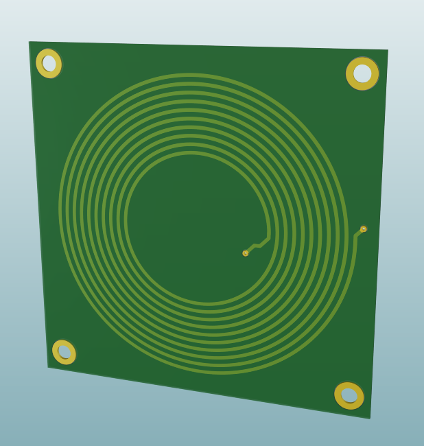

# MagSim — Planar Magnetorquer Simulator

MagSim is a Python-based simulator and design visualization tool for PCB-integrated embedded planar magnetorquers.
It provides a GUI to parameterize, visualize, and export planar coils for Altium Designer, while allowing real-time torque and dipole moment calculations based on the Earth’s magnetic field.

<p align="center">
  
  
</p>
---

## Why I Built This Project

I am currently building a small-scale concept satellite called PicoSat, which is roughly 50mm x 50mm x 50mm, based on the concept of the CubeSat platform.
While it does not actually conform to the standard measurements of a cubesat, I have carried over many of the same design concepts; therefore, I have dubbed it a 1/4U cubesat.

<p align="center">
  
</p>

This tool will ultimately be used to support that project.

---

## What Are Planar Magnetorquers?

Planar magnetorquers are copper spirals **embedded directly into a satellite’s PCB**.
When current flows through these traces, they generate a magnetic dipole moment **μ = N·I·A**, which interacts with the Earth’s magnetic field **B** to produce torque:

$$
\boldsymbol{\tau}=\boldsymbol{\mu}\times\mathbf{B}
$$

Unlike traditional rod magnetorquers, planar versions:

* Require **no dedicated volume or mechanical assembly**.
* Are **lightweight**, leveraging existing PCB copper layers.
* Can be **reconfigured in series/parallel** via onboard electronics to adjust torque or power draw.
* Can act as part of a **3-axis detumbling system** when placed orthogonally on multiple faces.

This approach was inspired by the research in:

> **Khan, S. A. et al. (2023)**
> *PCB-Integrated Embedded Planar Magnetorquers for Small Satellites Intelligent Detumbling*
> Zhejiang University, China / Swansea University, UK.
> DOI: 10.1016/j.asr.2022.02.020

---

## Mathematical Basis

The magnetic dipole moment of a planar coil is derived from:

$$
\mu = N\,I\,A
$$

where

* *N* = number of loops
* *I* = coil current (A)
* *A* = effective area (m²)

For a **circular Archimedean spiral**,
$$
A=\pi\!\left(R_{\text{out}}^{2}-R_{\text{in}}^{2}\right)
$$

and the torque produced in Earth’s field is given by:

$$
\tau=\mu\,B_{E}\,\sin(\theta)
$$

where *θ* is the angle between the dipole vector and the geomagnetic field.
At low Earth orbit (LEO), MagSim uses a default **Earth field magnitude of ~45 µT**, though this can be adjusted or integrated with real magnetic field models via `geomag`.

These formulations and their physical modeling are derived from Section 3.1 and 3.2 of Khan et al., covering:

* **Planar magnetorquer analytical model**
* **B-dot detumbling control formulation**

---

## How to Use

### Installation

```bash
git clone https://github.com/yourusername/MagSim.git
cd MagSim
pip install -r requirements.txt
```

### Run the simulator

```bash
python -m magsim
```

### Exporting to Altium

* Click "Export to Altium Designer DXF"
* Save the file
* In Altium PCB, click File -> Import -> DXF/DWG
* Use the presets shown in the image below
* Change trace width to the desired width
* Click "OK" **Warning: This really slows Altium down**

<p align="center">
  
</p>

### GUI Overview

* **Coil Length / Width (mm):** defines the planar footprint
* **Number of Loops:** total spiral turns
* **Trace Width & Clearance (mil):** defines copper geometry
* **Current (A):** operating current through the coil
* **Vector Angle (°):** angle between coil normal and magnetic field in degrees

### Features

| Feature                | Description                                                 |
| ---------------------- | ----------------------------------------------------------- |
| **Coil Renderer**      | Visualizes the spiral using a parametric Archimedean model  |
| **Torque Calculator**  | Computes instantaneous torque and dipole strength           |
| **Earth Field Model**  | Uses fixed or geomagnetic library field strength            |
| **DXF Exporter**       | Generates Altium-compatible DXF outlines                    |

---

## Example Calculation

For a 50 mm × 50 mm circular planar coil with 30 loops, 0.1 A current, and 45 µT Earth field:

$$
\mu = 30 \times 0.1 \times \pi (0.025^2 - 0.005^2) = 0.0056\ \text{A·m}^2
$$

$$
\tau = \mu \, B_\text{E} \, \sin(90^\circ) = 0.0056 \times 45\times10^{-6} = 2.52\times10^{-7}\ \text{N·m}
$$

<p align="center">
  
</p>

---

## Future Additions

MagSim is under active development, with planned features including:

* [ ] **Square Coils** are far more efficient than circular, and I would like to be able to generate them for my project
* [ ] **Triple-axis visualization** with real-time vector torque display
* [ ] **IGRF-based Earth field modeling** with altitude & location inputs
* [ ] **Thermal dissipation modeling** based on coil copper thickness
* [ ] **Multilayer PCB Modeling** Single PCB with many layers of connected coils

---

## References

* Khan, S. A. et al. (2023). *PCB-Integrated Embedded Planar Magnetorquers for Small Satellites Intelligent Detumbling.*
  *Advances in Space Research* (Zhejiang University).
* Lovera, M. (2015). *Magnetic Satellite Detumbling: The B-Dot Algorithm Revisited.*
* Mughal, M. R., et al. (2020). *Optimized Design and Thermal Analysis of Printed Magnetorquers.*

---

## Author

**Christopher Pederson**
Electrical Engineer — University of Waterloo
Developer of MagSim and small-satellite hardware design.

---

## License

This project is open-source under the MIT License.
